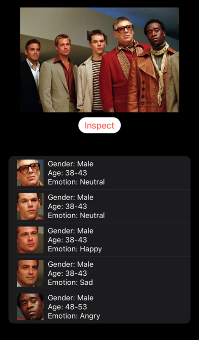

#  Minitrue: An iOS APP that detects age, gender, and emotion

## Collaborators
[Yuanqi Wang](https://github.com/plasmas) and [Xi Qiu](https://github.com/robnanarivo)

## Functionality
Given an input image, Minitrue will first run face detection to determine how many faces are there in the picture. If there is at least one face present in the picture, Minitrue will analyze the given faces and output a list with analytics for each face.

## Tech Stack
We used
- SwiftUI for front-end interface
- CoreML for model induction
- Vision for face detection

## Acknowledgement
This project made use of codes and ML models from [cocoa-ai/FacesVisionDemo](https://github.com/cocoa-ai/FacesVisionDemo) and boilerplate code from the tutorial [azamsharp/SwiftUICamera](https://github.com/azamsharp/SwiftUICamera).

## Original Hackathon Proposal
[Google Doc](https://docs.google.com/document/d/1W0GXftiL9nzEyKrjnAbfNvyALeSwonaBFNIAbjedBWQ/edit?usp=sharing)
